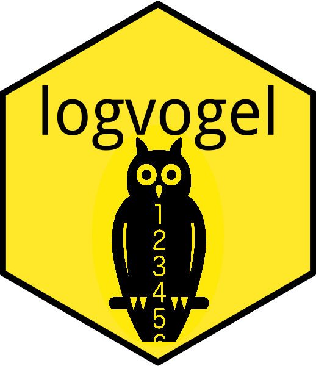

logvogel 
=====================================================================

[](https://travis-ci.org/cszang/logvogel)


## Overview

Tracking progress from parallel processes is hard, e.g. when running a
`foreach::foreach()` loop. One [recommended
solution](http://blog.revolutionanalytics.com/2015/02/monitoring-progress-of-a-foreach-parallel-job.html)
is to print the status to an external logfile. This is the strategy of
`logvogel`: it provides an easy way to monitor long-running loops from an
external R process using logfiles. Simultaneous write access to the logfile from
parallel processes is prevented using the lock mechanism from
[seagull](https://github.com/richfitz/seagull).

## Installation

```r
devtools::install_github("cszang/logvogel")
```

## Usage

### In the `foreach` construct

Use `logfile()` to create a new logfile. This creates an `R6` class instance,
whose handling is similar to `dplyr::progress_estimated()`. The resulting
logfile can be printed, updated with `.$update()`, and removed with
`.$remove()`.

Example:

```r
library(foreach)
library(parallel)
library(doSNOW)

cl <- makeCluster(detectCores())
registerDoSNOW(cl)

n <- 100
loop_log <- logfile("loop_log", n)

foreach(i = 1:n, .packages = c("logvogel")) %dopar% {
  Sys.sleep(rnorm(1, mean = 4))
  loop_log$update()
}

loop_log$remove()
```

### In the monitoring process

Start another R process, preferably in the same root directory. Then use
`logvogel::status()` to track the status of the loop.

Example:

```r
logvogel::status("loop_log")
```

### Package name

The name `logvogel` is a German pun on the word "Lockvogel", which means "decoy".
